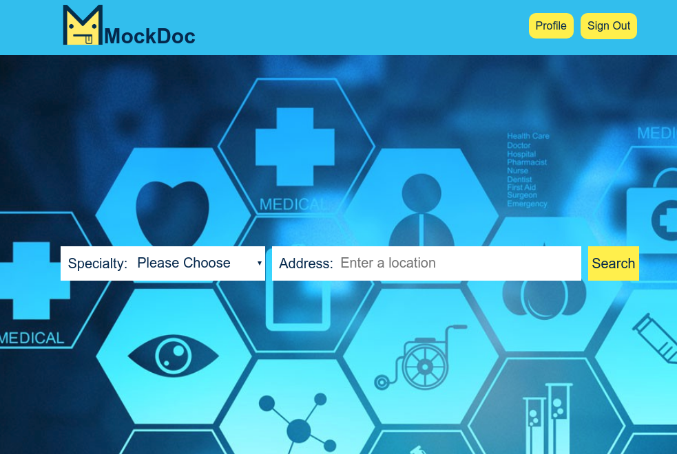

# MockDoc

MockDoc is a demo full-stack web application for booking appointments. Features include searching for doctors, scheduling appointments, and leaving reviews.

The idea behind the platform is that users can request free service from lousy doctors, offering a "fairer" bargain than what most US patients have to put up with.

## Stack

* Frontend: **React** 16.X.X & **Redux** 3.X.X
* Backend: **Ruby on Rails** 5.1.3 as an API (**Ruby** 2.5.1)
* Database: **PostgresQL** 10.X
* Styling: **Sass** preprocessor

* **External APIs:**
  * [Google maps API](https://developers.google.com/maps/documentation/javascript/)

* **Gems:**
  * [Ruby Geocoder](https://github.com/alexreisner/geocoder)
  * [Paperclip](https://github.com/thoughtbot/paperclip)
  * [AWS-SDK-Ruby](https://github.com/aws/aws-sdk-ruby)

* **JS Libraries:**
  * [Moment.js](https://momentjs.com/docs/)
  * [Lodash.js](https://lodash.com)
  * [React Router](https://github.com/ReactTraining/react-router)
  * **Webpack 3**

[Getting Started][setup]

[setup]: docs/setup.md

## Implementation Details

* [API Endpoints][API Endpoints]
* [Component Hierarchy][hierarchy]
* [Sample State][state]
* [Schema][schema]
* [Design Choices][choices]

  [API Endpoints]: docs/api-endpoints.md
  [hierarchy]: docs/component-hierarchy.md
  [state]: docs/sample-state.md
  [schema]: docs/schema.md
  [choices]: docs/choices.md
