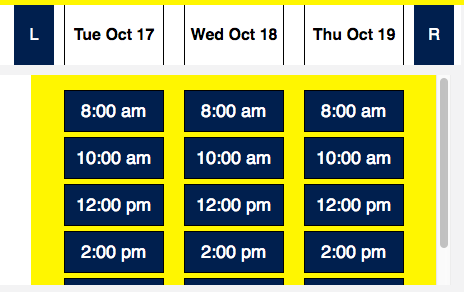

# MockDoc

**Link to Site:** [MockDoc](https://www.mockdoc.live/)

MockDoc is a full-stack web application based off ZocDoc, an appointment-booking app.

---

## Technologies

* Frontend Framework: **React** 15.X.X & **ReduX** 3.X.X
* Backend: **Ruby on Rails** 5.1.3 as an API (**Ruby** 2.3.1)
* Database: **PostgresQL** 9.6
* Styling: **Sass** preprocessor

* **Other APIs:** [Google maps API](https://developers.google.com/maps/documentation/javascript/)
* **Gems:** [Ruby Geocoder](https://github.com/alexreisner/geocoder)
* **JS Libraries:** [Moment.js](https://momentjs.com/docs/), [Lodash.js](https://lodash.com), [React Router](https://github.com/ReactTraining/react-router)

* **Webpack 2**, for bundling files and managing transpilation
* **Node 6.10.1**, for package management

---

## Features & Implementation

**TL;DR Summary:**

* MockDoc implements some of the core features of ZocDoc:
  1. User _**authentication**_
  2. Doctor _**profiles**_: Displays doctor information including reviews and open appointments.
  3. _**Search**_ functionality: Search for doctors by specialty and location
  4. _**Appointment**_ scheduling: Users can book appointments just by clicking on a link.
  5. Appointment _**reviews**_: Leave a review after an appointment has taken place.
  * Google Maps allows displaying doctor offices near a patient's home
  * Geocoder enables searching for doctors a given distance (default 30 miles) from the search address
  * The redux store is kept normalized at all times with separate slices of state for Doctors, Reviews, Appointments, and login credentials. This prevents the state from becoming too complex over time.

* [API Endpoints][API Endpoints]
* [Component Hierarchy][hierarchy]
* [Sample State][state]
* [Schema][schema]

  [API Endpoints]: docs/api-endpoints.md
  [hierarchy]: docs/component-hierarchy.md
  [state]: docs/sample-state.md
  [schema]: docs/schema.md

### Database Layout

[DB schema][schema]

[schema]: docs/schema.md

**Key Details:**

* Join tables exist between doctors & specialties and doctors & certifications because doctors can have more than one of each.
* Doctor addresses are stored as latitude and longitude (lat and lng, respectively) to interface with Google Maps API and Ruby Geocoder.

### Authentication

**Backend:** Passwords are encrypted with  _**BCRypt**_ prior to storage. New session tokens are created on login and logout to protect users against _**CSRF**_ attacks.

**Frontend:** A user's login status is preserved via _**bootstrapping**_.

* User information is added to the _**Redux store**_,
* This information is then deleted from the window.
* Site access is restricted until users log in with the following code:

```javascript
const Auth = ({ component: Component, path, loggedIn }) => {
  return(<Route path={path} render={(props) => (
    !loggedIn ? (
      <Redirect to="/signin" />
    ) : (
      <Component {...props} />
    )
  )} />);
};
```

### Doctor Profiles

**Backend:** For demo purposes, doctors are treated like business profiles instead of users.

**Frontend:** Doctors have arrays of review and appointment IDs used to look up related data for rendering while keeping the state normalized.


### Searching for Doctors

**Backend:** To reduce loading time only a limited number of appointments are retrieved for each doctor returned in a search request, specifically unbooked appointments up to a week from the initial start day:

```ruby
def index
  processed_specialty = params[:specialty].downcase
  doctors = Doctor.near(params[:address], 30)
    .includes(:specialties, :certifications, :reviews, :appointments)
    .joins(:specialties, :appointments).where(
      specialties: { name: processed_specialty },
      appointments: {
        start_time: (Time.now)..(Time.now + 6.day),
        patient_id: nil
        })

  @doctors = doctors.select do |doctor|
    doctor.specialties.pluck(:name).include?(processed_specialty)
  end
end
```

* To improve runtime speed the app also applies _**eager loading**_, retrieving all associated information for all doctors in _**one**_ query to the database.

**Frontend:** Users can search for doctors of many specialties anywhere (default search area New York).

* A _filter_ slice of state manages the current search query and is updated based on the inputs to the search bar. The search results UI is very similar to  ZocDoc in organization:


### Scheduling Appointments

**Backend:** All appointments are premade for demo purposes. Rather than creating appointments, patients update the booking status of an appointment via their ID.

**Frontend:** Significant processing time goes into sorting appointments. Because the store is normalized appointments in search results first need to be sorted by doctor and then by day. This way, appointments are displayed such that appointments for a given day and doctor appear in order:



_**Moment.js**_ is instrumental in handling time. It greatly simplifies sorting and displaying appointment times and is essential for making comparisons between JS _Datetime_ objects and the date recording format used by PostGreSQL.

### Reviews

**Backend:** Reviews are retrieved with doctors (and the user) in the same manner as appointments. Additionally an average rating is computed from all of a doctor's reviews based on the average of the overall rating score.

**Frontend:** ZocDoc promotes the integrity of its review process in a bid to attract more patients and doctors. Patients cannot leave reviews unless an appointment has taken place, and all appointments are reviewed for their objective quality.

* I can't vet reviews like they do, but I can replicate some of the other restrictions.
* Patients can only leave reviews if they've scheduled appointments.
* Patients cannot review an appointment until after that appointment has taken place, as determined by the code below:

```javascript
const appointmentButtons = (appointment, review, callback) => {
  const startTime = moment(appointment.start_time);
  if (startTime._d > new Date()) {
    return <button onClick={callback}>Cancel Appointment</button>;
  } else if (review === undefined) {
    return <Link to={`/review/appointment-${appointment.id}`}>
             Write Review
           </Link>;
  }
};
```

Implementing this restriction without _**Moment.js**_ would have posed significant challenges.

---

## Next Steps: Future Directions for the Project

Beyond improving the site's performance and refactoring code I intend to implement the following features in the near future:

### Appointment Scrolling

ZocDoc has a feature where users can check appointment availability over the next three-day time span for a doctor with just the click of a button, indicating many appointments are retrieved at once. I intend to implement a similar feature by manipulating the state of the search index and doctor profiles.

### Fuzzy Searches

Right now the search functionality is limited in what queries it accept. I intend to change that, implementing more robust search functionality that will enable patients to find doctors more easily.

* Elastisearch is one possibility I've considered.

### Other Potential Directions

* Responsive design: make it mobile-friendly.
* Multiple users: doctors are paid users with a different set of privileges than patients.
* Photos: Doctors have profile pictures on ZocDoc. AWS will help in the implementation for storing photos.
* Wellness plans: Healthcare guidelines are provided to the user based on demographic information.
