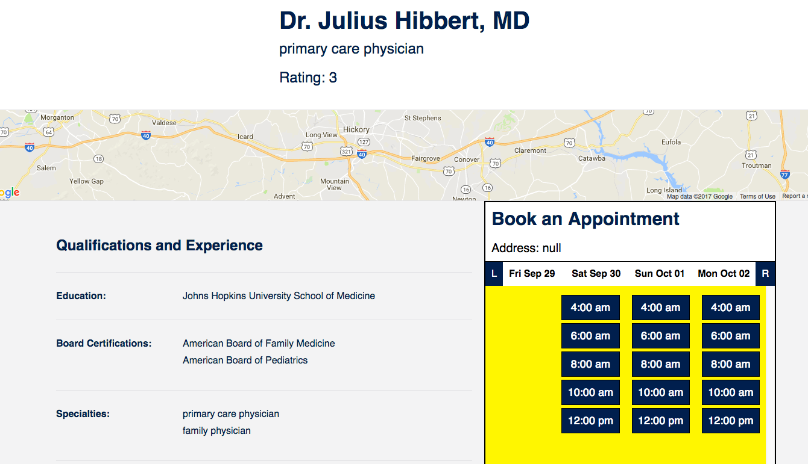
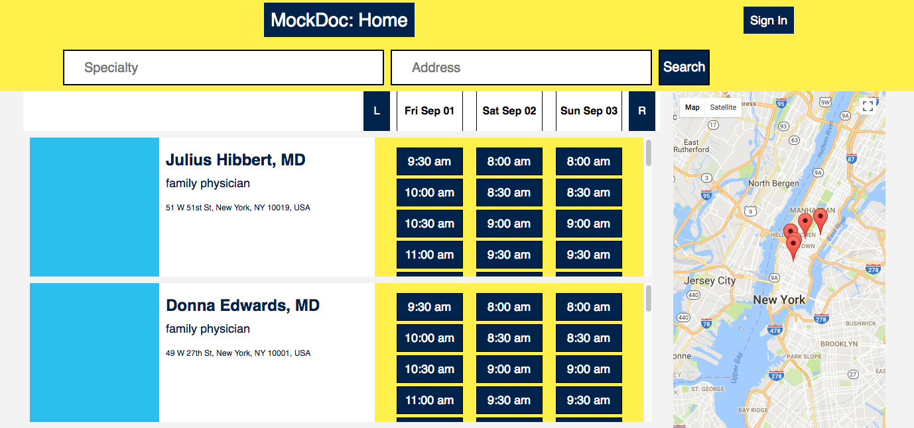

# MockDoc
-----
**Link to Site:** [MockDoc](https://www.mockdoc.live/)


MockDoc is a full-stack web application based off ZocDoc, an appointment-booking app. I employed **React.js** with **Redux** as the architectural framework on the frontend. On the backend I'm using **Ruby on Rails** and a **PostgreSQL** database. Styling was accomplished with **Sass**.

* **APIs:** [Google maps API](https://developers.google.com/maps/documentation/javascript/)
* **Gems:** [Ruby Geocoder](https://github.com/alexreisner/geocoder)
* **JS Libraries:** [moment.js](https://momentjs.com/docs/)
* **Ruby version:** 2.3.1
* **Rails version:** 5.1.3
* **PostgreSQL version:** 9.6

* **Additional Technologies:**
  - webpack, for bundling files and managing transpilation
  - node.js, for managing JS packages
  - lodash.js, for various helper functions

## Features & Implementation
-----
### Authentication:
** - Users can log in and out of the site, and access to features is restricted based on login status.**

**Backend:** Basic auth is handled for users with _BCRypt_ to store securely store password digests in the database. New session tokens are created on login and logout to protect users against _CSRF_ attacks.

**Frontend:** Site access is restricted based on login status. Users are directed away from pages for booking appointments and writing reviews until they have signed in.
- _Bootstrapping_ is applied to preserve a user's login status by loading the current user to the window and using it to configure the _Redux store_, promptly deleting user information from the window afterwards.

```
const Auth = ({ component: Component, path, loggedIn }) => {
  return(<Route path={path} render={(props) => (
    !loggedIn ? (
      <Redirect to="/signin" />
    ) : (
      <Component {...props} />
    )
  )} />);
};
```

---
### Doctor Profiles:
** - Users can view a doctor's information on that doctor's profile page along with past reviews and upcoming open appointments.**

**Backend:** For demo purposes, doctors are treated like business profiles on Yelp rather than a second set of users.
- Doctors have associations with specialties, certifications, reviews, and appointments. Each doctor's data is stored with several attributes including specialty, education and location.
- Locations are inputted as postal addresses and stored as geographic coordinates with the aid of the _Geocoder_ gem.
- Geocoder is also used get addresses from coordinates to display to users on the frontend.

Specialties and certifications were made into independent tables in spite of their limited nature (only ~30 boards and ~50 specialties are recognized in the US) because of the _many-to-many_ relationship existing between them and doctors. Doctors are associated with certifications and specialties via join tables.

**Frontend:** When a doctor's profile is loaded their associated appointments, reviews, specialties and certifications are loaded along with them. Google maps displays their work address for the patient.
- Appointments and reviews are stored in separate slices of state.
- Doctors have arrays of review and appointment IDs used to retrieve relevant appointments and reviews to render.



-----
### Searching for Doctors:
** - Site users can search for doctors by location and specialty.**

**Backend:** Search filter parameters are sent as data in _GET_ requests for doctors. The app searches for doctors in a given area around the specified location, then filters the results by the specialty indicated by the user.

```
def index
  processed_specialty = params[:specialty].downcase
  doctors = Doctor.near(params[:address], 30)
    .includes(:specialties, :certifications, :reviews, :appointments)
    .joins(:specialties, :appointments).where(
      specialties: { name: processed_specialty },
      appointments: {
        start_time: (Time.now)..(Time.now + 6.day),
        patient_id: nil
        })

  @doctors = doctors.select do |doctor|
    doctor.specialties.pluck(:name).include?(processed_specialty)
  end
end
```
- Geocoder simplifies the process of searching for doctors near a given address (up to 30 miles away by default)
- To improve runtime speed the app applies _eager loading_, retrieving all associated information for all doctors in _one_ query to the database.
- To reduce loading time only appointments a week in advance of the current date are retrieved for each doctor as doctors can potentially schedule appointments months in advance which could result in significant loading times.

**Frontend:** Users can start searching for doctors before logging in. By default the search feature looks for primary care doctors in New York, but users can search for doctors anywhere based on specialty.
- A _filter_ slice of state manages the current search query and is updated based on the inputs to the search bar.

On the search index page each index consists of a miniature profile with links to the doctor's page and available appointments. Google maps is also integrated showing the doctors' location on a map which remains on the page as the user scrolls through search results. The UI is very similar to  ZocDoc in organization:



-----
### Scheduling Appointments:
** - Book appointments by selecting from a doctor's available upcoming appointments. **

##### ** This was by far the most challenging portion of the app to implement. Rendering appointments was difficult for several reasons:

- Appointments need to be sorted and displayed by start time, but making comparisons with _Date_ objects in JS (and formatting them) is difficult.
- Initially the sorting process was also very slow.

**Backend:** Initially I sped up the app with custom _SQL_ applied in a scope argument to the appointments association for doctors:

- Essentially, Only the next week of unbooked appointments was retrieved in the association.
  + This approach permitted eager loading for doctors without having to retrieve all the doctor's appointments.
  + The downside was its inflexibility; only appointments up to a week in advance of the current date could ever be seen.
  + This dilemna was easily solved with an additional join on the appointments table, filtering by time ranges.

**Frontend:** Sorting, formatting and displaying of appointment times is simplified with the _moment.js_ library. In search results appointments are first sorted by doctor 

-----
### Reviews:

##### ** Implementing reviews did not come without challenges. At this point I learned I had set model associations in such a way that I wasn't retrieving the right information for doctors, forcing me to rethink all my associations.


**Backend:**


**Frontend:**
-----
## Next Steps: Future Directions for the Project

Beyond improving the site's performance I intend to implement the following features in the near future:

**Fuzzy Searches**

Right now the search functionality is limited in what it accepts and provides no hints as to how to make successful queries. I intend to change that, implementing more robust search functionality that will enable patients to find doctors more easily.

**Appointment Scrolling**

ZocDoc has a feature where users can appointment availability over the next three-day time span for a doctor with just the click of a button. I intend to implement a similar feature by manipulating the state of the search index and doctor profiles.

**Other Potential Directions:**
* Responsive design: make it mobile-friendly.
* Multiple users: doctors are paid users with a different set of privileges than patients.
* Photographed insurance: Patients can take photos of their insurance ID for faster booking.
* Online form fill-out: Patients can fill out forms for doctors ahead of the appointment online.
* Wellness plans: Healthcare guidelines are provided to the user based on demographics.
